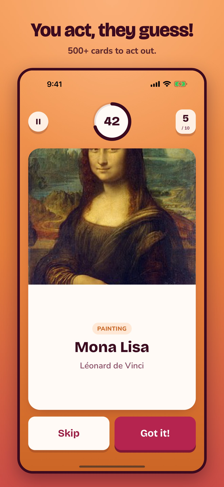
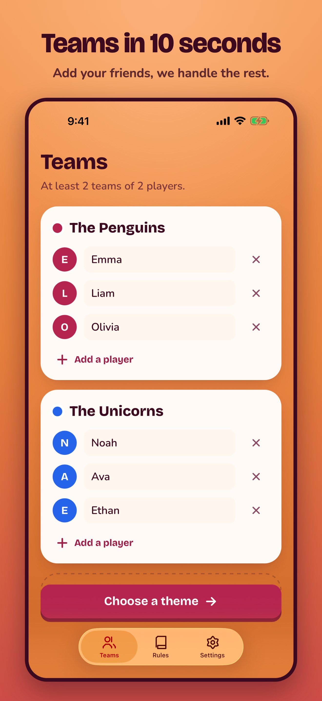
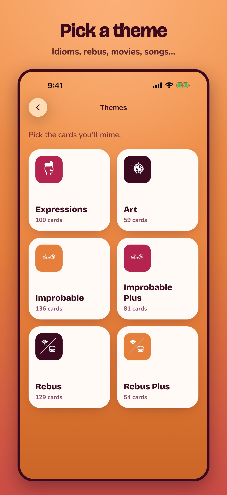
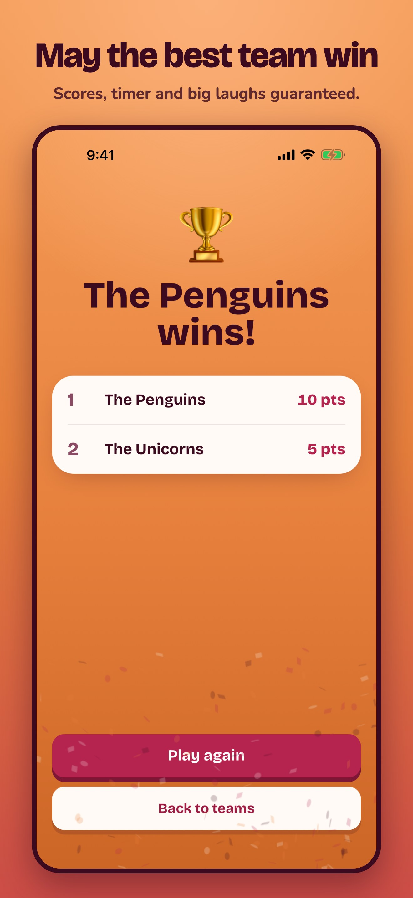

# Mimesis

The charades party game: one phone, friends, zero words. In English, French, Spanish, Portuguese, German, Italian, Japanese and Chinese. Live on the [App Store](https://apps.apple.com/app/id1559423136) and [Google Play](https://play.google.com/store/apps/details?id=ee.forgr.mimesis).

<p>
  
  
  
  
</p>

Mimesis is the reference app for the [Capgo](https://capgo.app) stack: a Vue web app shipped as a native iOS and Android app with Capacitor, updated over the air, built in the cloud and published to both stores from one push to `main`.

## Stack

| Layer                              | What                                                                                                                                                                 |
| ---------------------------------- | -------------------------------------------------------------------------------------------------------------------------------------------------------------------- |
| App                                | Vue 3, Pinia, Vue Router, Tailwind CSS 4, Vite                                                                                                                       |
| Native shell                       | [Capacitor 8](https://capacitorjs.com)                                                                                                                               |
| Native chrome                      | [`@capgo/capacitor-native-navigation`](https://github.com/Cap-go/capacitor-native-navigation): system tab bar (Liquid Glass on iOS 26+), navbar and safe-area insets |
| Page transitions                   | [`@capgo/capacitor-transitions`](https://github.com/Cap-go/capacitor-transitions): iOS/Android page stack with swipe back                                            |
| Live updates                       | [`@capgo/capacitor-updater`](https://github.com/Cap-go/capacitor-updater)                                                                                            |
| Native builds and store publishing | [Capgo Cloud Build](https://capgo.app/docs/cli/cloud-build/getting-started/)                                                                                         |
| Other plugins                      | `@capgo/native-audio`, `@capgo/capacitor-crisp`, `@capacitor/haptics`, keep-awake, in-app review                                                                     |
| Backend                            | Cloudflare Worker + D1 + R2 in [`backend/`](backend), served at `api.mimesis.fun`                                                                                    |
| Website                            | Static site in [`website/`](website), a Cloudflare Worker with static assets                                                                                         |

## Release pipeline

Every push to `main` runs [`release.yml`](.github/workflows/release.yml):

1. `capacitor-standard-version` bumps `package.json`, `android/app/build.gradle` and the Xcode project from the conventional commits, writes `CHANGELOG.md` and tags the release.
2. The web build is uploaded to the Capgo `production` channel with `--delta`. Every installed app with compatible native code gets it on next launch, no store review.
3. `capgo bundle compatibility` compares the native plugins with what is in the stores. When native code changed, Capgo Cloud Build compiles iOS and Android and runs `--submit-to-store-review`, so both builds go to App Store and Google Play review automatically. `--auto-min-update-version` keeps the new bundle away from older store builds until they update.

Other workflows: [`ci.yml`](.github/workflows/ci.yml) (lint, types, tests, build), [`deploy_api.yml`](.github/workflows/deploy_api.yml) (Worker + D1 migrations) and [`deploy_website.yml`](.github/workflows/deploy_website.yml).

Required secrets: `CAPGO_TOKEN`, `CLOUDFLARE_API_TOKEN`, plus the Capgo build credentials (`BUILD_CERTIFICATE_BASE64`, `P12_PASSWORD`, `APPLE_KEY_ID`, `APPLE_ISSUER_ID`, `APPLE_KEY_CONTENT`, `APP_STORE_CONNECT_TEAM_ID`, `CAPGO_IOS_PROVISIONING_MAP`, `ANDROID_KEYSTORE_FILE`, `KEYSTORE_KEY_ALIAS`, `KEYSTORE_KEY_PASSWORD`, `KEYSTORE_STORE_PASSWORD`, `PLAY_CONFIG_JSON`).

## Develop

```bash
bun install
bun run dev          # web app on http://localhost:3332, talks to api.mimesis.fun
bun run api:dev      # local Worker with a local D1 (set VITE_API_URL=http://localhost:8787)
bun run test         # unit tests
bun run sync         # build and copy into the native projects
bunx cap open ios    # or android
```

## Languages

The app follows the device language on first launch and can be switched in Settings.

| What                                              | Where                                                                                                                                                          |
| ------------------------------------------------- | -------------------------------------------------------------------------------------------------------------------------------------------------------------- |
| App UI                                            | `locales/<code>.yml`                                                                                                                                           |
| Random player and team names                      | `locales/names/<code>.json`                                                                                                                                    |
| Cards                                             | `backend/content/<code>.json`, loaded into D1 by a migration built with `bun scripts/build-content-migration.ts migrations/<n>_<name>.sql` (run in `backend/`) |
| Store listing, release notes, screenshot captions | `store/listing/<store-locale>.json`, mapped to App Store and Play locale codes in `store/locales.json`                                                         |

Cards are written for each language, not translated: local idioms, rebus puns that work in that language, and the local titles of films and books.

## Store listings and screenshots

`store/screenshots/<store-locale>/` holds the framed App Store (6.9" iPhone, 13" iPad) and Google Play captures for every language. To refresh them, build once with `VITE_DEMO=teams`, install it on an iPhone 6.9" and an iPad 13" simulator and an Android emulator, then:

```bash
bun scripts/capture-screenshots.ts <raw> iphone=<udid> ipad=<udid> android=<adb serial>
bun scripts/compose-screenshots.ts <raw>   # also renders store/play/<store-locale>/feature-graphic.png
```

Push the listings (text, screenshots, Play graphics) for every language with fastlane:

```bash
fastlane ios listing version:<editable App Store version>
fastlane android listing
```

`VITE_DEMO` only stages screens for captures; it is stripped from production builds.

## App icon and splash

Sources live in `assets/` (`icon.svg`, `icon-foreground.svg`, `icon-background.svg`, `splash.svg` and their PNG renders). Regenerate the native sets with:

```bash
bunx @capacitor/assets generate --ios --android --iconBackgroundColor '#f08442' --splashBackgroundColor '#f08442'
```

## Backend

`backend/` is a Hono Worker with:

- `GET /v1/catalog?lang=<code>`: themes and every card of that language in one cached response, so the app plays offline after the first launch. Unknown languages get English.
- `POST /v1/games`: records finished games per device.
- `GET /images/*`: card covers from R2.

`backend/scripts/migrate-from-supabase.ts` is the one-shot migration that moved the original Supabase data into D1 and R2.

## License

[AGPL-3.0](LICENCE.md)
